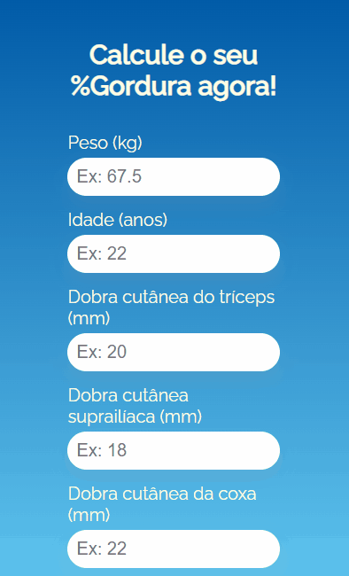

# Calculadora de Dados Corporais

### Projeto pessoal de uma calculadora que retornasse o Percentual de Gordura, Massa Magra e Massa Gorda a partir dos dados inseridos.
## Sobre o projeto

Um projeto pessoal simples, criado para exercitar a lógica e raciocínio matemático, treinar Javascript e testar conhecimentos do DOM
## Tecnologias Usadas

Para completar o desafio usei:
 - HTML
 - CSS
 - Javascript
 - Tags Semânticas
 - CSS Flexbox
 
## O Projeto Rodando

#### Versão Desktop

#### Versão Mobile
