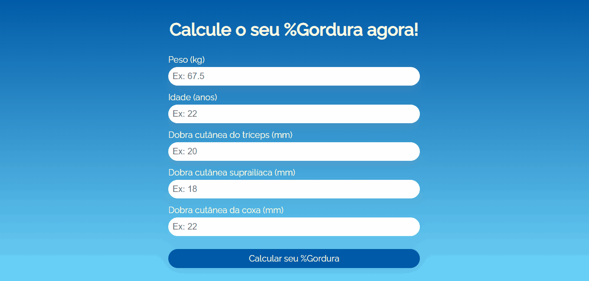

<h1 align="center"> Calculadora de Dados Corporais </h1>

Um projeto pessoal simples, criado para exercitar a lógica e raciocínio matemático, treinar Javascript e testar conhecimentos do DOM, resolvendo problemas comuns aos estudantes de Educação Física  

  <a href="#-tecnologias">Tecnologias</a>&nbsp;&nbsp;&nbsp;|&nbsp;&nbsp;&nbsp;
  <a href="#-deploy">Deploy</a>&nbsp;&nbsp;&nbsp;|&nbsp;&nbsp;&nbsp;
  <a href="#-english-version">English Version</a>&nbsp;&nbsp;&nbsp;&nbsp;&nbsp;&nbsp;

  

## 🚀 Tecnologias

Esse projeto foi desenvolvido com as seguintes tecnologias:

- HTML e CSS
- JavaScript
- Git e Github
- Figma

## 💻 Deploy

> [Clique aqui para navegar para o projeto!](https://ssschneider.github.io/calculadora-percentual-gordura/)

## 🌎 English Version

Body Data Calculator is a personal project with the goal of helping PE students calculate easily and more precisely the data necessary only by informing a few things. To do that, I've used:
- HTML, CSS, JS, Git, Guthub and Figma

> You can check out the deploy by [clicking here](https://ssschneider.github.io/calculadora-percentual-gordura/)

---
### Desenvolvido por Sarah Schneider 🖖